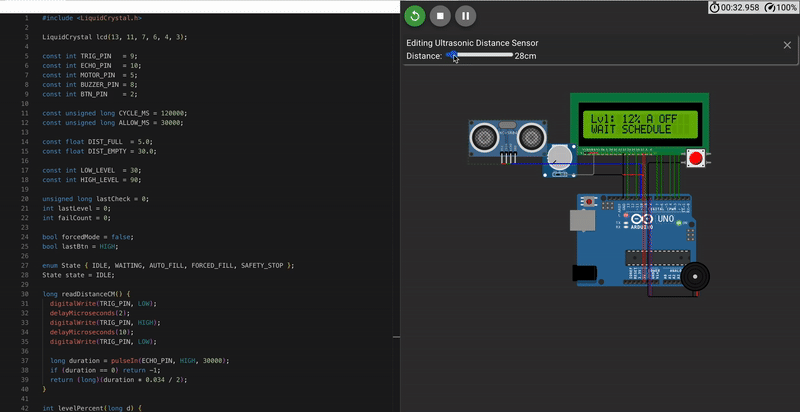

# Smart Water Tank System (FSM Architecture) 🚰

A robust, automated water level control system powered by **Arduino**. This project utilizes a **Finite State Machine (FSM)** architecture to ensure reliable operation, non-blocking multitasking, and intelligent error handling.

## 🚀 Key Features

* **Finite State Machine (FSM):** The system logic is built around defined states (`IDLE`, `AUTO_FILL`, `WAITING`, `SAFETY_STOP`, `FORCED_FILL`) preventing undefined behaviors.
* **🛡️ Fail-Safe Mechanism:** Includes a smart safety algorithm that detects pump failure or pipe leakage. If the pump runs but the water level doesn't rise within a specific timeframe, the system triggers a **Safety Stop** and sounds an alarm.
* **⏱️ Non-Blocking Logic:** Uses `millis()` based timers instead of `delay()`, allowing the system to read sensors, update the LCD, and check inputs simultaneously without freezing.
* **Interactive UI:** Real-time status display on a 16x2 LCD (Water Level %, Pump State, System Mode).
* **Manual Override:** A physical button allows the user to force-start the pump regardless of the automated schedule/logic.

## 🛠️ Hardware Components

* Arduino Uno
* HC-SR04 Ultrasonic Sensor (Distance measurement)
* 16x2 LCD Display (I2C or Parallel)
* DC Motor (Simulating Water Pump)
* Active Buzzer (Alarm)
* Push Button (Manual Control)
* Potentiometer (LCD Contrast)

## ⚙️ How It Works (The Logic)

The system continuously measures the distance to the water surface. Based on the calculated percentage:
1.  **Low Level (<30%):** Pump starts automatically (if within the allowed time window).
2.  **High Level (>90%):** Pump stops.
3.  **Safety Check:** During filling, the system monitors the level change rate. If no change is detected for **16 seconds** while the pump is active, the **Emergency Stop** is activated.

## 💻 Simulation

You can test the live simulation of this project on Wokwi:
**[https://wokwi.com/projects/451078412626923521]**

## 📸 Screenshots

## 📸 Demo Preview

---
*Developed by [Your Name] - Computer Science Student at BAU*
